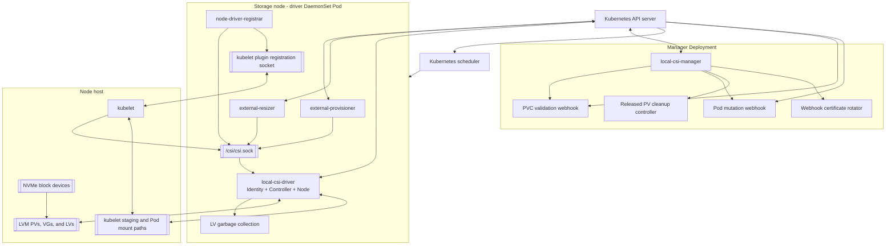
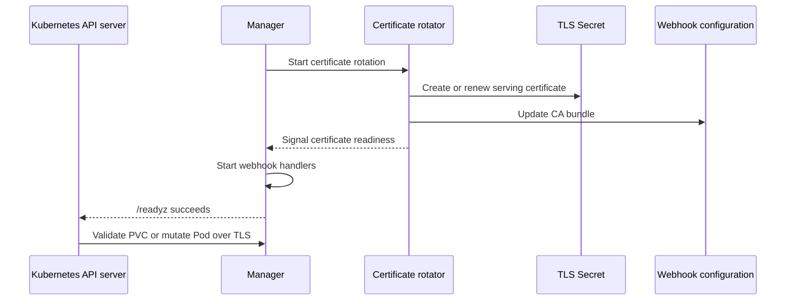
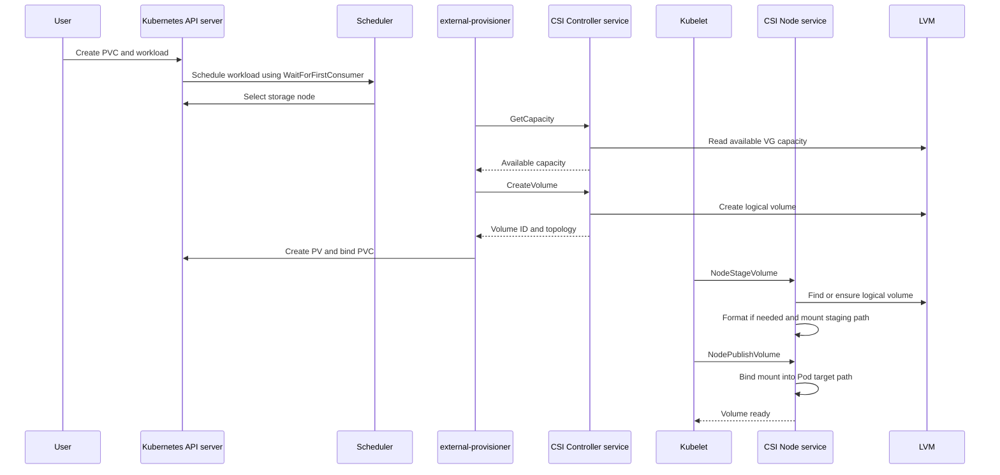
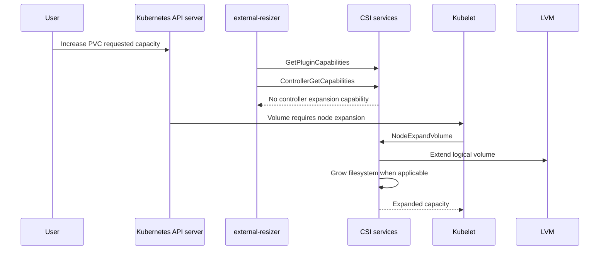
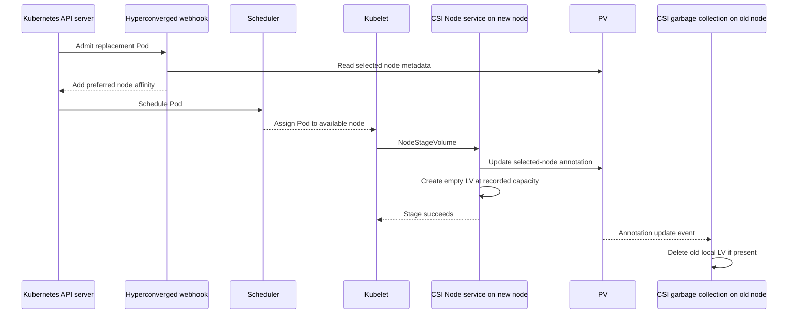
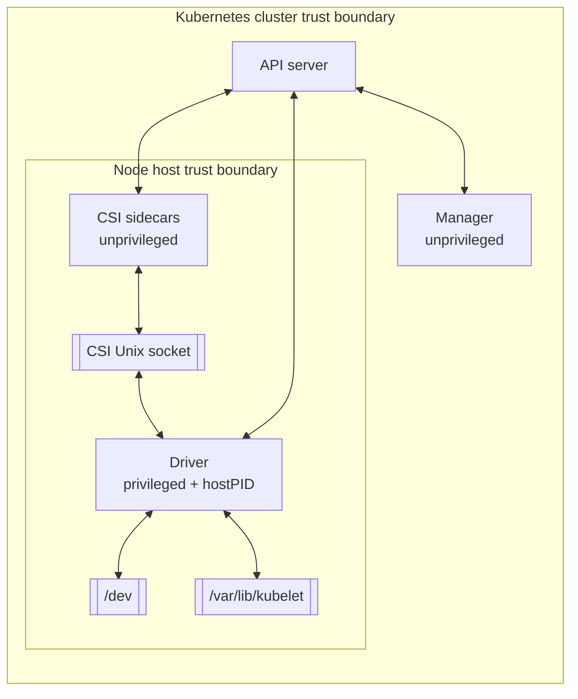

# local-csi-driver Architecture

local-csi-driver exposes node-local NVMe storage through the Kubernetes
Container Storage Interface (CSI). It discovers eligible block devices, manages
them with LVM, and mounts logical volumes into workload Pods.

The driver is designed for fast local storage. A volume exists on one node at a
time and does not contain replicas. If recovery moves a volume to another node,
the driver creates a new empty logical volume. Applications must be able to
rebuild or rehydrate data that is stored on these volumes.

This document explains the system architecture and request flows. For
installation and configuration tasks, see the
[User Guide](user-guide.md). For current Helm values and defaults, see the
[Helm chart README](../charts/latest/README.md).

## System overview

The Helm chart deploys two binaries:

- The **driver** runs on each selected storage node as part of a DaemonSet. It
  hosts the CSI Identity, Controller, and Node services, manages local LVM
  storage, and runs node-scoped garbage collection.
- The **manager** runs as a Deployment. It hosts admission webhooks, rotates
  their serving certificates, and runs cluster-scoped PV cleanup.

The driver Pod also contains the standard CSI provisioner, resizer, and node
driver registrar sidecars. The sidecars and kubelet call the driver over a Unix
domain socket. The manager does not serve CSI requests.



## Driver DaemonSet

Each driver Pod is node-scoped and contains four primary containers:

| Container | Responsibility | CSI calls |
| --- | --- | --- |
| `driver` | Serves CSI, manages LVM and mounts, and runs node cleanup | Receives all implemented CSI RPCs |
| `csi-provisioner` | Watches PVC and PV lifecycle and requests capacity and volume operations | Identity calls, `ControllerGetCapabilities`, `GetCapacity`, `CreateVolume`, and `DeleteVolume` |
| `csi-resizer` | Watches PVC expansion and coordinates node expansion | Identity calls, capability discovery, and expansion coordination |
| `csi-registrar` | Registers the CSI driver with kubelet | `GetPluginInfo` |

The driver runs all three CSI services in one gRPC server:

- **IdentityServer** reports plugin identity, capabilities, and readiness.
- **ControllerServer** provisions and deletes node-local logical volumes.
- **NodeServer** stages, publishes, measures, and expands volumes on the node.

All three services share `/csi/csi.sock` inside the Pod. The socket is backed by
the host directory:

```text
/var/lib/kubelet/plugins/localdisk.csi.acstor.io/
```

Kubelet plugin registration uses a different socket under
`/var/lib/kubelet/plugins_registry/`. The registrar serves kubelet registration
requests on that socket and obtains the driver name from `GetPluginInfo` on the
CSI socket.

The driver does not use leader election. Every node must run its own CSI server
and node-scoped cleanup controllers.

## Manager Deployment

The manager uses controller-runtime and can run three independently configured
features:

- The enforce-ephemeral validating webhook
- The hyperconverged mutating webhook
- The Released-PV cleanup controller

Leader election ensures that one manager replica is active for controller work.
When webhooks are enabled, the certificate rotator creates and renews the
serving certificate and updates the webhook configurations with the CA bundle.
The manager does not report ready until certificate setup is complete and the
webhook server has started. Other manager replicas remain available to acquire
leadership if the active replica stops.

The webhook configurations use `failurePolicy: Ignore`. If the manager or
webhook service is unavailable, the API server allows the request without the
driver's validation or affinity mutation. This favors cluster availability but
means that admission behavior is not guaranteed during a webhook outage.



## CSI RPC surface

The driver implements more RPC handlers than it advertises as controller
capabilities. CSI clients must use the advertised capabilities to decide which
operations are part of the supported deployment path.

### Identity service

| RPC | Purpose |
| --- | --- |
| `GetPluginInfo` | Returns the driver name and version |
| `GetPluginCapabilities` | Reports controller service support |
| `Probe` | Reports whether the plugin is ready |

### Controller service

The driver advertises `CREATE_DELETE_VOLUME` and `GET_CAPACITY`.

| RPC | Status | Purpose |
| --- | --- | --- |
| `CreateVolume` | Implemented and advertised | Creates an LVM logical volume on the selected node |
| `DeleteVolume` | Implemented and advertised | Unmounts the staging path and deletes the logical volume |
| `GetCapacity` | Implemented and advertised | Reports available capacity for the requested topology and volume group |
| `ControllerGetCapabilities` | Implemented | Returns the advertised controller capabilities |
| `ValidateVolumeCapabilities` | Implemented | Validates access type, access mode, and volume existence |
| `ListVolumes` | Implemented but not advertised | Lists driver-managed volumes |
| `ControllerPublishVolume` | Unimplemented | The driver does not attach remote storage |
| `ControllerUnpublishVolume` | Unimplemented | The driver does not detach remote storage |
| `ControllerExpandVolume` | Unimplemented | Expansion is performed by the Node service |
| `ControllerGetVolume` | Unimplemented | Not part of the supported capability set |
| `ControllerModifyVolume` | Unimplemented | Not part of the supported capability set |
| Snapshot RPCs | Unimplemented | The driver does not provide CSI snapshots |

### Node service

The driver advertises `STAGE_UNSTAGE_VOLUME`, `EXPAND_VOLUME`, and
`GET_VOLUME_STATS`.

| RPC | Purpose |
| --- | --- |
| `NodeGetInfo` | Reports the node ID and topology segment |
| `NodeGetCapabilities` | Reports staging, node expansion, and volume statistics support |
| `NodeStageVolume` | Ensures the LV exists, formats it when needed, and mounts the staging path |
| `NodeUnstageVolume` | Defers staging-path unmount to `DeleteVolume` |
| `NodePublishVolume` | Bind mounts the staged filesystem or block device into a Pod path |
| `NodeUnpublishVolume` | Unmounts the Pod target path |
| `NodeGetVolumeStats` | Reports filesystem or block-device usage |
| `NodeExpandVolume` | Expands the local LV and filesystem |

## Volume lifecycle

The normal filesystem volume lifecycle is:



### Creation

`CreateVolume` runs in the provisioner sidecar on the node selected through
`WaitForFirstConsumer` topology. The driver:

1. Validates the request and capacity range.
2. Selects the configured volume group.
3. Creates an LV using the CSI volume name.
4. Returns the volume ID, capacity, context, and topology.

If a volume group contains more than one physical volume, the driver creates an
LVM RAID0 logical volume with one stripe per physical volume. If the optional
mdadm RAID initializer is enabled, the volume group is instead built on the
mdadm device.

When the hyperconverged webhook is enabled and the provisioner supplies PVC
metadata, the driver removes accessible topology from the response and stores
the creating node in
`localdisk.csi.acstor.io/selected-initial-node`. The webhook then manages
workload affinity without immutable PV node affinity.

### Staging and publishing

`NodeStageVolume` prepares storage for use on the node. It locates the LV,
creates it when recovery requires an empty replacement, formats new filesystem
volumes, and mounts the staging path.

`NodePublishVolume` exposes the staged volume to a Pod:

- Filesystem volumes use a bind mount from the staging path.
- Raw block volumes use the local device path and a bind mount to the target
  file.
- Read-only requests add the read-only mount option.

The kubelet-visible paths are under `/var/lib/kubelet`. The driver mounts this
host directory with bidirectional mount propagation so mounts created in the
container are visible to kubelet and workload Pods.

### Unpublishing and deletion

`NodeUnpublishVolume` removes the Pod target mount. `NodeUnstageVolume`
intentionally leaves the staging mount in place to preserve the page cache
between Pods that reuse the same volume.

`DeleteVolume` therefore owns final staging cleanup. It identifies the node
that owns the volume, unmounts the staging path, and deletes the LV. A staging
unmount failure causes `DeleteVolume` to return an error rather than removing
the LV.

This behavior differs from orphan and failover garbage collection. Those
controllers log an unmount failure and may continue deleting an orphaned LV.
Operators should investigate repeated unmount failures because an LV can be
removed while stale mount state remains on the host.

## Expansion lifecycle

The driver advertises node expansion but not controller expansion. The
external-resizer discovers this through the CSI capability calls. Kubernetes
then asks kubelet to expand the volume on the node.



The expanded capacity is recorded in PV metadata. If availability-mode recovery
later recreates the volume on another node, the replacement LV uses the
expanded size.

## Scheduling and recovery modes

The StorageClass parameter
`localdisk.csi.acstor.io/failover-mode` controls how the hyperconverged webhook
adds node affinity.

| Mode | Affinity | Behavior when the storage node is unavailable |
| --- | --- | --- |
| `availability` | Preferred | The Pod may move to another node and receive a new empty volume |
| `durability` | Required | The Pod remains pending until a node with the existing volume is available |

`availability` is the default when the value is missing or invalid. Pods that
reference multiple local-csi-driver PVs should use the same mode for every PV.
The current webhook applies the mode from the last processed PV to the combined
node list, so mixed modes can produce order-dependent behavior.

### Availability-mode failover



The important recovery properties are:

- The replacement volume is empty. This is failover for workload availability,
  not data replication.
- For a period of time, old and new nodes can both contain an LV with the same
  CSI identity.
- The `selected-node` annotation records current ownership.
- Event-driven and periodic garbage collection remove the old copy.

For a detailed description, see
[PV Recovery](design/pv-recovery.md).

## Cleanup ownership

Cleanup is split between node-local driver controllers and the manager.

| Component | Scope | Trigger | Action |
| --- | --- | --- | --- |
| `DeleteVolume` | Owning node | PV deletion through external-provisioner | Unmount staging path and delete the LV |
| PV failover reconciler | One driver Pod | `selected-node` annotation changes | Delete the LV from a node that no longer owns it |
| LVM orphan scanner | One driver Pod | Periodic scan | Delete LVs with no PV or an ownership mismatch |
| Released-PV cleanup controller | Manager | Released PV with `Delete` reclaim policy | Delete the PV and remove blocking finalizers when all topology nodes are unavailable |
| Driver shutdown cleanup | One driver Pod | Driver termination when enabled | Clean up unused LVM resources managed by the driver |

The periodic scanner finds tagged driver-managed volume groups. If none are
found, it also checks the default volume group. The Helm chart controls the
deployed scan interval; the binary has its own fallback default when started
without the chart.

The manager cleanup controller only handles PVs with the driver name, a
`Released` phase, a `Delete` reclaim policy, relevant finalizers, and hostname
topology. It preserves the finalizers if any topology node still exists and is
Ready. If no topology node is available, it issues a PV delete and removes the
PV protection and external-provisioner finalizers.

## Privilege and trust boundaries

The driver is a privileged storage component. Compromise of the driver
container can expose the node's devices and kubelet mount tree.



Key boundaries and controls include:

- The driver runs privileged, uses host PID visibility, mounts `/dev`, and
  mounts `/var/lib/kubelet` with bidirectional propagation.
- The optional RAID init container is privileged and uses `nsenter` to execute
  in host namespaces.
- CSI sidecars and the manager disable privilege escalation, drop Linux
  capabilities, and use read-only root filesystems.
- The CSI socket is a local Unix socket shared with sidecars and kubelet. It
  does not use network TLS or CSI client authentication.
- The driver and manager use separate Kubernetes service accounts and RBAC.
- Webhook traffic uses TLS certificates managed by the certificate rotator.
- Webhooks fail open because their configurations use
  `failurePolicy: Ignore`.
- Disk discovery and cleanup can modify or remove data from selected devices.
  Disk-selection changes must be reviewed as destructive-storage changes.

## Observability

The driver, manager, and sidecars expose different observability surfaces.
Port numbers and enablement are Helm values and should be read from the
[Helm chart README](../charts/latest/README.md).

| Surface | Owner | Notes |
| --- | --- | --- |
| Prometheus metrics | Driver | The chart configures the driver endpoint as unauthenticated HTTP |
| Secure metrics | Manager | Uses controller-runtime authentication and authorization filters when secure serving is enabled |
| Health and readiness | Driver and manager | The manager readiness check also waits for webhook certificates and server startup |
| Sidecar HTTP endpoints | Provisioner, resizer, and registrar | Used for sidecar health and operational metrics |
| Kubernetes Events | Driver and manager controllers | Record provisioning, cleanup, recovery, and failure information |
| OpenTelemetry traces | Driver and manager binaries | Disabled unless an endpoint and a nonzero sample rate are configured; the chart currently exposes driver trace values |
| pprof | Driver and manager | Disabled unless explicitly enabled |

The combined CSI server logs each unary gRPC method. Frequent discovery and
statistics calls use a higher verbosity level than lifecycle operations.

## Debugging by lifecycle stage

| Symptom | Start with | Relevant code |
| --- | --- | --- |
| Driver does not register | Registrar logs, driver `GetPluginInfo`, and CSI socket mounts | `internal/csi/identity`, `internal/csi/server` |
| PVC remains Pending | Provisioner logs, StorageClass binding mode, topology, and `GetCapacity` | `internal/csi/controller`, `internal/csi/core/lvm` |
| Pod cannot mount | Kubelet and driver Node RPC logs, staging path, LV, and filesystem state | `internal/csi/node`, `internal/csi/mounter` |
| Expansion remains incomplete | Resizer logs, kubelet events, and `NodeExpandVolume` | `internal/csi/node` |
| Pod schedules on the wrong node | Webhook availability, failover mode, PV annotations, and mutated Pod affinity | `internal/webhook/hyperconverged` |
| Released PV is stuck | Manager logs, PV phase, reclaim policy, finalizers, and topology-node readiness | `internal/manager/pvcleanup` |
| Capacity remains consumed | PV ownership annotations and both driver garbage collectors | `internal/gc` |

See the [Troubleshooting Guide](troubleshooting.md) for operator commands.

## Code ownership map

| Change | Primary location |
| --- | --- |
| Driver flags and node process composition | `cmd/driver/main.go` |
| Manager flags, certificates, webhooks, and leader election | `cmd/manager/main.go` |
| CSI server startup and gRPC interception | `internal/csi/server` |
| Identity RPC behavior | `internal/csi/identity` |
| Controller RPC behavior | `internal/csi/controller` |
| Node RPC behavior | `internal/csi/node` |
| LVM allocation, capacity, and volume operations | `internal/csi/core/lvm` |
| Mount and unmount behavior | `internal/csi/mounter` |
| Node-local failover and orphan cleanup | `internal/gc` |
| Released-PV finalizer cleanup | `internal/manager/pvcleanup` |
| PVC validation | `internal/webhook/enforceEphemeral` |
| Pod affinity mutation | `internal/webhook/hyperconverged` |
| Kubernetes deployment and security context | `charts/latest/templates` |
| Supported configuration and deployed defaults | `charts/latest/values.yaml` |

Changes to CSI RPC behavior, advertised capabilities, idempotency, error codes,
or capacity handling must remain conformant with the CSI specification and
should include focused tests. Changes to disk discovery, LVM deletion, host
mounts, privileges, or cleanup behavior should be treated as security-sensitive
and destructive-storage changes.

## Related documentation

- [User Guide](user-guide.md) - install and configure the driver
- [Troubleshooting Guide](troubleshooting.md) - diagnose operational failures
- [Development Guide](development.md) - build and test the project
- [PV Recovery](design/pv-recovery.md) - detailed recovery behavior
- [PV Cleanup](design/pv-cleanup.md) - PV deletion when a node is lost
- [Webhooks](design/webhooks.md) - admission webhook behavior
- [Disk Selection](design/disk-selection.md) - device selection design
- [Helm chart reference](../charts/latest/README.md) - configuration values and
  defaults
