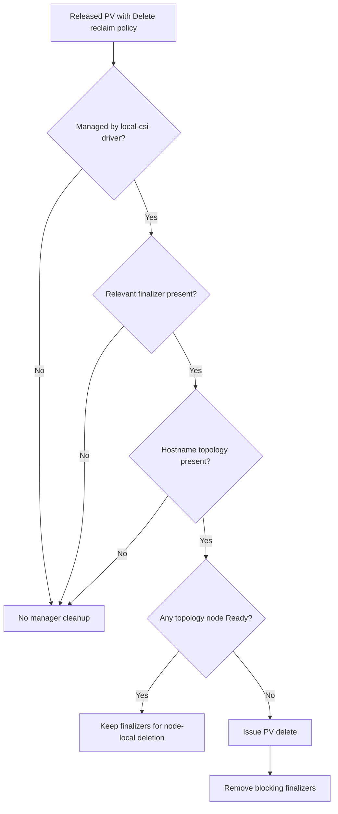

# local-csi-driver PersistentVolume Cleanup

A local PersistentVolume can become stuck during deletion when the node that
owned its storage is permanently unavailable. local-csi-driver has two
different deletion paths depending on whether the PV contains immutable
hostname topology.

This cleanup removes Kubernetes objects and local LVM storage when possible. It
does not recover application data from a lost node.

## Normal deletion

The external-provisioner runs in node-deployment mode. For a PV with hostname
topology, it routes `DeleteVolume` to the driver instance on the owning node.
That driver:

1. Confirms that the request belongs to the node.
2. Unmounts the retained staging path.
3. Deletes the LVM logical volume.
4. Returns success so the external-provisioner can complete PV deletion.

If the owning node is unavailable, no driver instance can complete this path
and the PV can remain blocked by finalizers.

## Cleanup with hostname topology

The manager's Released-PV cleanup controller handles the missing-node case for
PVs that still contain hostname topology.

The controller only processes a PV when all of the following are true:

- The CSI driver is `localdisk.csi.acstor.io`.
- The PV phase is `Released`.
- The reclaim policy is `Delete`.
- The PV has `kubernetes.io/pv-protection` or
  `external-provisioner.volume.kubernetes.io/finalizer`.
- The PV contains
  `topology.localdisk.csi.acstor.io/node` hostname constraints.

The controller checks every hostname in the PV topology. If any corresponding
Node exists and is Ready, it leaves the finalizers in place so the node-local
driver can perform normal storage deletion.

If no topology node is Ready, the controller:

1. Issues a delete request for the PV if it does not already have a deletion
   timestamp.
2. Reconciles the PV again after deletion begins.
3. Removes the PV protection and external-provisioner finalizers.

This allows the Kubernetes object to disappear even though storage on a
missing node cannot be reached or scrubbed.

## Cleanup without hostname topology

When the hyperconverged webhook is enabled, `CreateVolume` normally omits
accessible topology and stores ownership in PV metadata instead. All
node-deployed provisioners can then receive `DeleteVolume`.

Each driver compares its node ID with:

1. `localdisk.csi.acstor.io/selected-node`
2. `localdisk.csi.acstor.io/selected-initial-node` when the current selection
   is absent

The owning node deletes the LV. Other nodes return `FailedPrecondition` while
the selected node still exists. If the selected node no longer exists, a
driver returns success so the external-provisioner can finish deleting the PV.

The manager cleanup controller intentionally skips PVs without hostname
topology. In this mode, CSI deletion success and standard Kubernetes finalizer
handling complete deletion. Any inaccessible storage on the deleted node
cannot be cleaned by the cluster.

## Relationship to LV garbage collection

PV cleanup and LV garbage collection solve different problems:

| Mechanism | Deletes Kubernetes PV | Deletes local LV |
| --- | --- | --- |
| `DeleteVolume` | No | Yes, on the owning node |
| Manager Released-PV cleanup | Yes | No |
| Event-driven failover cleanup | No | Yes, on the old node |
| Periodic orphan cleanup | No | Yes, when an LV has no PV or wrong ownership |

The manager must not claim that storage was scrubbed when it only removed the
PV object and finalizers.

## Failure behavior

- Failure to delete or patch a PV is returned for reconciliation retry.
- A PV that disappears while finalizers are being removed is treated as
  successfully cleaned.
- A Node that exists but is not Ready does not block manager cleanup.
- Retain-policy PVs are never processed by the manager cleanup controller.
- Normal `DeleteVolume` stops if staging-path cleanup fails.

## Related documentation

- [Architecture](../architecture.md) - deletion and cleanup ownership
- [PV Recovery](pv-recovery.md) - moving ownership and cleaning old-node LVs
- [Webhooks](webhooks.md) - topology behavior when hyperconverged mode is
  enabled
